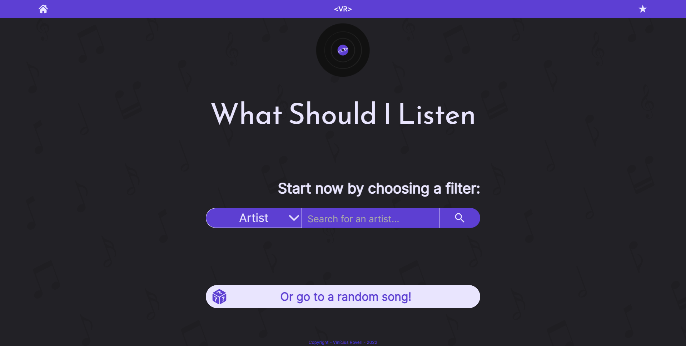

# What Should I Listen ([Website link](https://whatshouldilisten.vercel.app/))

## What is this?

A website developed with React, Typescript, SASS/SCSS, Jest, Recoil and React Router used to give the user personalized song recommendations. Recommendations can be based on your taste in artist, genre or vibe. The user can also use the random recommendation, in addition to a favorites tab to save the songs they may want.

## Why is this?

To solve the common problem when you want to listen to something, but you have no idea what it really is, or you have the impression that none of the songs you know are good for the moment.

## What challenges did I overcome working on this?

- ### Multiple filters working at the same time

The part of actually filtering the songs wasn't the hardest part, but for a better user experience I tried to give some particularities to the filters on the Search page.

- ##### Filters can not repeat

When the user does a search by Artist for example, the following filters could not give him the option to choose another artist, only the other filter options should be available (Genre and Vibe in this case). Therefore, for the filter to know which options it should offer, I chose to pass an `Array of Possible Filters` via `props`, and each time a filter is added or removed, the filters present are mapped to remove from the `Array` those that already exist and leave only the correct options for the user to select

- ##### User can not change more than one filter at once

This was, above all, an aesthetic choice. If several changes were allowed at the same time, not only would the logic of possible filters become much more complex, but the UI would also become very confusing and disorganized with multiple filters and options open on the screen. For that, whenever a filter is added or removed I pass via `props` to all the filters present, except the last one, a property that makes so that they can't open, and I use it in the internal logic of the component to make it fixed in the position that the user left it last time.

- ##### Actually filter the songs

With several filters, the filtering logic remains the same, but repeated as many times as necessary. The value of the search `input` is captured, a new `RegExp` is created from it, and finally the `.test` method is used to verify if there are matches for this search in the song information. The only thing that varies with various searches is where these matches are looked for, in the case of searching for Artist it is looked for in the values of `artist`, for Genre in `genre`, and for Vibe in `vibes`.

- ### Make the application work as full-stack

As someone specialized in the front-end, I had only used APIs with `Node`, `Express` and `Mongoose` in rare study projects, so I had to go discovering the problems of making a front-end integrated with the back-end as the development process went on. Among these problems whose solution I had to find are:

- ##### Make Axios get the API data

MongoDB still doesn't offer support for making `HTTP` requests like `GET`, `POST`, `PUT` and `DELETE` directly to the database, so I needed to enter with the advent of Express to air a server locally where I could make such queries. But as a local server, it only resolved things locally, and that led me to the second problem:

- ##### Make API data public to requests

After some research I discovered that when uploading `.json` files via GitHub Pages it was possible to make `GET` requests using the link that leads to the file's page. Knowing this, and having access to the API data locally, I use `fs.writeFile()` to create a file in a separate directory and place that directory on GitHub Pages to get the links. But this only gave me access to `GET`, now I needed to find a way to handle all the other requests.

- ##### Create an interface for locally controlling the API

Since I already had full access to the API locally, and I had also found a way to make the data queryable, the only step left was to do the middle ground so that my changes in the local API would be reflected in the public API. For this I created an interface where only I can modify API data through all `HTTP` requests, and whenever the interface identifies an update it uses `fs.writeFile()` again to update the file responsible for the public API with the data updated. After that, just I do a `push` to the `.json` files into the repository so that the public API is updated and the queries work normally.

- ### Songs page system

For better performance I decided to separate the song list by pages of 50, both on the Search and the Favorites pages. For that, it was enough to use a `state` that says what the current page is and the `.splice` method to separate the correct songs from the complete `array` of the API. Then I created the page selector at the end of the list so that the user could easily find its location and navigate.

- ### Favorites songs logic

This logic is divided into two parts: how the user knows that a certain song is marked as a favorite; and how all these user tagged songs are displayed on the Favorites page.

- ##### Favorites songs being saved

In the functions that add or remove favorite songs, all information of a certain song is passed as parameters, the functions extract the id of the song and add or remove it from a specific `array` in `localStorage` accordingly. The `array` is stored there so that the user has access to these songs whenever he enters the site through the device through which he saved them.

- ##### Button to favorite present on song's pop-up

In addition to all the song information used to create the popup (will be explained later in this document), I added a star icon at the top right of the popup that when clicked adds or removes a song from the favorites list. Also to complete, when the pop-up is created I added a logic to it that already checks if the `id` of the current song is in the list of favorites, and if it is, it already leaves the star at the top checked, indicating this fact to the user.

- ##### Designated songs being shown at the Favorites page

The first step when the page is loaded is to fetch the data of all the songs from the API (also explained in more detail later in the document), and then use the `.filter` method on this result to leave only the songs whose `id` is included in the list of favorites in the `localStorage`. Then I just use the `.map` in the `array` of the filtered songs and for each one create a card just like on the search page.

- ### Create song's pop-up when its card is clicked

To have a better performance I leave the pop-up permanently on the page, all that happens when the user clicks to see the information of a certain song is: the `display: none` property is removed from the pop-up; and the information of the clicked song is passed to a `State` which then is passed via `props` to the popup, and with it the song information is arranged in the popup.

- ### Make user's Homepage search navigate to the Search page 

For this, the Recoil library, for global state management, was used. First I created an `atom` that will contain the `state` of the query with its respective filter and search. Then I created a `hook` to get the value of this `state`, and another one to change it. Finally, just use these `hooks` when the search is made and create the filter component on the Search page with the info of that `state`.

- ### Favorite icon on song's card

The function used to determine if the song is a favorite is the same as on the Favorites page, but now it is consulted when creating cards, and if it identifies that the song `id` of a certain card is in the list of favorites, it adds the star icon.

- ### Where all the songs are stored

The songs are in a REST API on my GitHub, and I control it locally using an interface I developed, and doing all the necessary integrations using NodeJS, MongoDB, Express and Axios. Like this I can easily keep adding new songs there so the site is always more diversified and users have even more options.

- ### Jest's use for unitary tests

This was my first project using Jest and I was very excited about the possibility of learning to automate some tests and saving time in the future, in addition to always being fun the process of learning a new technology. I did some tests involving the use of certain components separating them by pages, these tests that can be seen in the `tests` folder inside `src`.

- ### Disc spinning on Homepage

This was yet another cool personal challenge that I wanted to include. As someone with an artistic background I firmly believe that the most important thing is not the tools, but who is behind them. That's why I challenged myself to create both that disk and its animation 100% with CSS, it's not the most conventional and definitely not the industry standard, but it was an interesting challenge to test my skills and add a beautiful asset to the project.